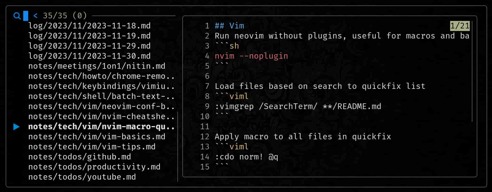

<div align = "center">

<h1><a href="https://github.com/2kabhishek/tdo">tdo</a></h1>

<a href="https://github.com/2KAbhishek/tdo/blob/main/LICENSE">
 </a>

<a href="https://github.com/2KAbhishek/tdo/graphs/contributors">
 </a>

<a href="https://github.com/2KAbhishek/tdo/stargazers">
</a>

<a href="https://github.com/2KAbhishek/tdo/network/members">
 </a>

<a href="https://github.com/2KAbhishek/tdo/watchers">
 </a>

<a href="https://github.com/2KAbhishek/tdo/pulse">
 </a>

<h3>Fast & Simple Note Taking! 📃🚀</h3>

<figure>
  
  <br/>
  <figcaption>tdo in action</figcaption>
</figure>

</div>

tdo is a opinionated, command line based note-taking system.

## ✨ Features

- Can help you manage a daily log, todos, journal and notes
- Quickly review pending and upcoming todos, past journal entries and more
- Integrates with git to commit and backup your notes automatically, check [tdo.nvim](https://github.com/2kabhishek/tdo.nvim) for neovim integration
- Has interactive fuzzy searching capabilities powered by fzf
- Can integrate with other tools in pipes and subshells for extended functionality
- Supports all editors, just set `$EDITOR` to your choice

## ⚡ Setup

### ⚙️ Requirements

- ripgrep, fzf
- bat (optional, for syntax highlighting in search)
- coreutils (required on macOS only, for gdate command)

#### 📦 Environment Variables

- `NOTES_DIR` should point to your notes directory
- `TODO_DIR` optional, should point to your todos directory, default: `NOTES_DIR/todos`
- `JOURNAL_DIR` optional, should point to your journal directory, default: `NOTES_DIR/entries`

- `EDITOR` set to your choice of editor

### 💻 Installation

```bash
git clone https://github.com/2kabhishek/tdo
cd tdo
# Link tdo to a directory that's in PATH (~/.local/bin here)
ln -sfnv "$PWD/tdo.sh" ~/.local/bin/tdo
# Create a notes dir if not already present
mkdir -p ~/Projects/notes
# Add the NOTES_DIR env var to your shell config ~/.bashrc, ~/.zshrc etc
echo "NOTES_DIR=~/Projects/notes" >> ~/.zshrc
# Reload shell config
source ~/.zshrc
# Add sample templates to your NOTES_DIR
cp templates $NOTES_DIR
```

## 🚀 Usage

If you use Neovim, I highly recommend using [tdo.nvim](https://github.com/2kabhishek/tdo.nvim), it seamlessly integrates `tdo` and `nvim` and adds some useful features on top.

- `tdo` to open today's todos
- `tdo <offset_days>` to open todos from `offset_days` in the past or future, e.g: `tdo 1`, `tdo -2`
- `tdo <note_title>` to open or create a `note_tile.md` note, use folder names to categorise notes, e.g: `tdo tech/vim-tips`
- `tdo note` or `tdo n` to create a new note with the current timestamp in `drafts`
- `tdo entry` or `tdo e` to open today's journal entry
- `tdo entry <offset_days>` to open journal entry from `offset_days` in the past or future, e.g: `tdo e -3`
- `tdo find <text>` or `tdo f` to interactively search for `text` in all your notes
- `tdo find` without any search term to review all your notes
- `tdo todo` or `tdo t` to show all your pending todos
- `tdo commit <path>` or `tdo c` to commit changes in path, happens automatically, only needed for plugins

> Run `tod h` to get help info on the command line

### 📁 Dir Structure

`tdo` expects an opinionated directory structure to function.

- Notes are kept in the `notes` dir, these are used for long term storage, second brain
- Notes use the [templates/note.md](./templates/note.md) file as template
- Todos are kept in `todos` dir, these can used for short term notes, daily todos
- Todos use the [templates/todo.md](./templates/todo.md) file as template
- Journal entries are kept in `entries` dir, these are used for personal notes, life logging
- Journal entries use the [templates/entry.md](./templates/entry.md) file as template

```
├── todos
│   └── 2023
│       └── 11
│           └── 2023-11-29.md
├── entries
│   └── 2024
│       └── 02
│           └── 2024-02-03.md
│── notes
│   └── tech
│       └── quit-vim.md
│       └── arch-btw.md
└── templates
    ├── entry.md
    └── note.md
    └── todo.md
```

### 💾 Git Integration

If any of your notes directory is under git, tdo will automatically commit every change with a timestamp like `03 Feb 11:33` as commit message.

## 🏗️ What's Next

You tell me!

## 🧑‍💻 Behind The Code

### 🌈 Inspiration

After trying out every note management system under the sun I had decided on using plain markdown notes [powered by nvim2k](https://youtu.be/FP7sQhc8kek).

tdo is a spiritual successor and complimentary tool to that, taking the same principles and making it more accessible and simple.

### 🧰 Tooling

- [dots2k](https://github.com/2kabhishek/dots2k) — Dev Environment
- [nvim2k](https://github.com/2kabhishek/nvim2k) — Personalized Editor
- [sway2k](https://github.com/2kabhishek/sway2k) — Desktop Environment
- [qute2k](https://github.com/2kabhishek/qute2k) — Personalized Browser

### 🔍 More Info

- [cmtr](https://github.com/2kabhishek/cmtr) — Easily commit and backup your notes

<hr>

<div align="center">

<strong>⭐ hit the star button if you found this useful ⭐</strong><br>

<a href="https://github.com/2KAbhishek/tdo">Source</a>
| <a href="https://2kabhishek.github.io/blog" target="_blank">Blog </a>
| <a href="https://twitter.com/2kabhishek" target="_blank">Twitter </a>
| <a href="https://linkedin.com/in/2kabhishek" target="_blank">LinkedIn </a>
| <a href="https://2kabhishek.github.io/links" target="_blank">More Links </a>
| <a href="https://2kabhishek.github.io/projects" target="_blank">Other Projects </a>

</div>
